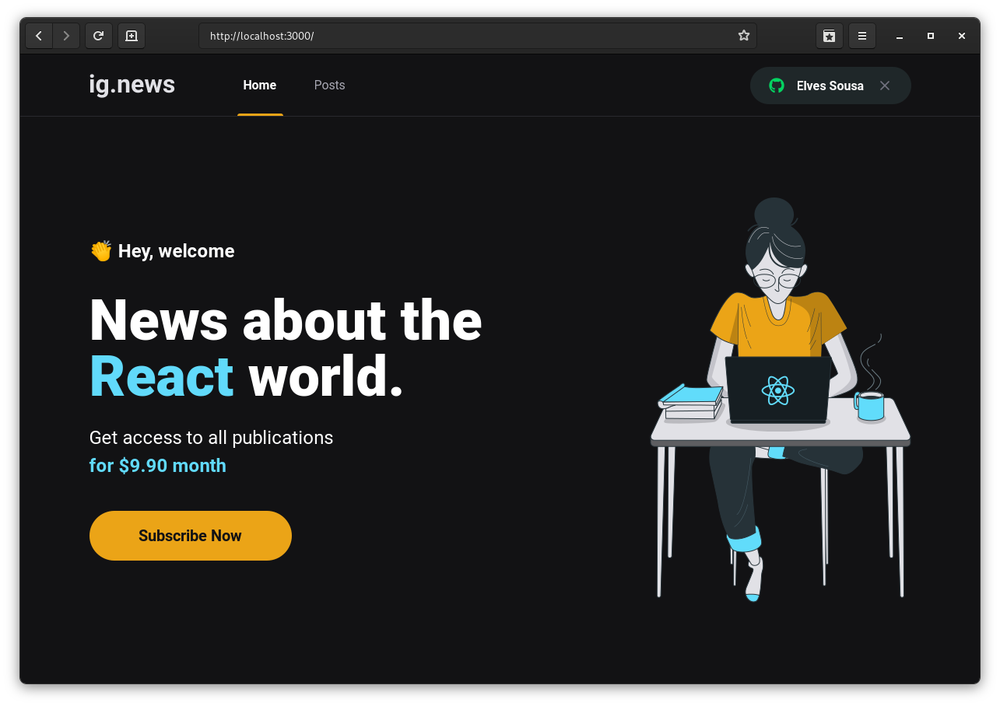

<h1 align="center">ig.news</h1>

#### Ignite

## Sobre o projeto

O **ig.news** é um site com suporte a inscrições pagas e publicações com acesso restrito, desenvolvido durante o Ignite da Rocketseat.

---

## Tecnologias utilizadas

Esse projeto foi desenvolvido utilizando as seguintes tecnologias abaixo:

- React
- Next.js
- Stripe
- FaunaDB
- Prismic CMS
- Sass
- TypeScript

---

## Como contribuir

- Crie um fork deste repositório
- Faça uma branch com a sua feature: `git checkout -b minha-feature`;
- Envie suas alterações: `git commit -m 'feat: Minha nova feature'`;
- Faça um push para a sua branch: `git push origin minha-feature`.
